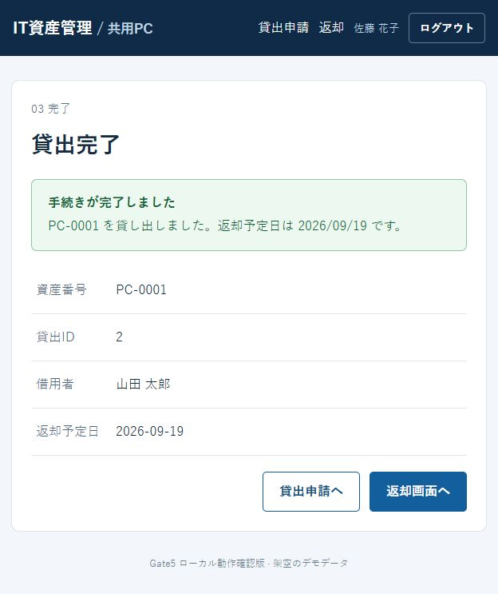
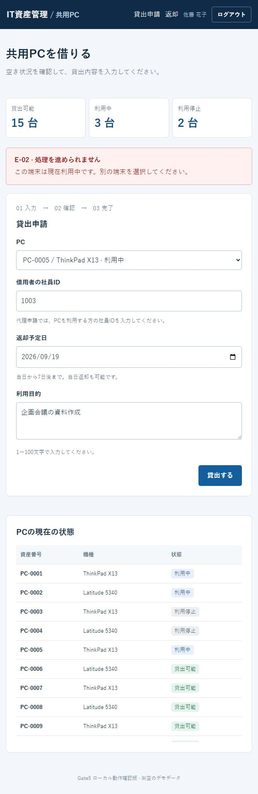
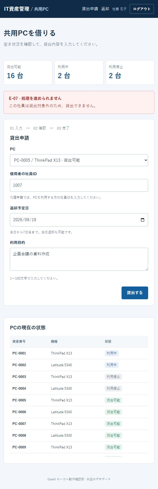

# モック画像一覧と再現方法

実アプリのブラウザ画面を2026-09-12に撮影。正常1枚、エラー4枚。貸出中のエラーは、入力時に空いていたPCを他の要求が先に確定する競合を再現した。本文の日付は撮影値。再現時は実行当日のDに置き換える。

初期状態の別DBで起動し、管理者1001 / demo1234でログインする。通常の入力から確定までが必要。単にURLでエラー画像を表示する実装ではない。

|画像|条件・手順|表示・確認項目|洗い出し|
|---|---|---|---|
|01_正常_貸出完了.png|PC-0001、借用者1002、返却D+7、目的入力→貸出する→確定|貸出完了と配布仕様の成功文言、貸出ID|正常系|
|02_異常_貸出中.png|PC-0005・借用者1003を確認画面まで進める。別タブでPC-0005・1004を先に確定。その後元の確認画面で確定|E-02、PC-0005が利用中。貸出先は1004の1件だけ|X-02／10|
|03_異常_過去日.png|PC-0005、借用者1003、返却D-1、目的入力→貸出する|E-11、日付範囲と入力値が残る|X-17|
|04_異常_退職者.png|PC-0005、借用者1007、返却D+7、目的入力→貸出する|E-07、貸出更新なし|X-06|
|05_異常_1人1台上限.png|01後、PC-0006・借用者1002で貸出する|E-08、既存PCの返却を促す|X-08|

撮影順は01→03→04→02→05。02の撮影では、確認画面を保持したまま別のStore接続で1004の正常な貸出処理を先行実行した。SQLで画面文言や状態だけを偽装していない。上表の別タブ操作でも同じ条件を再現できる。

