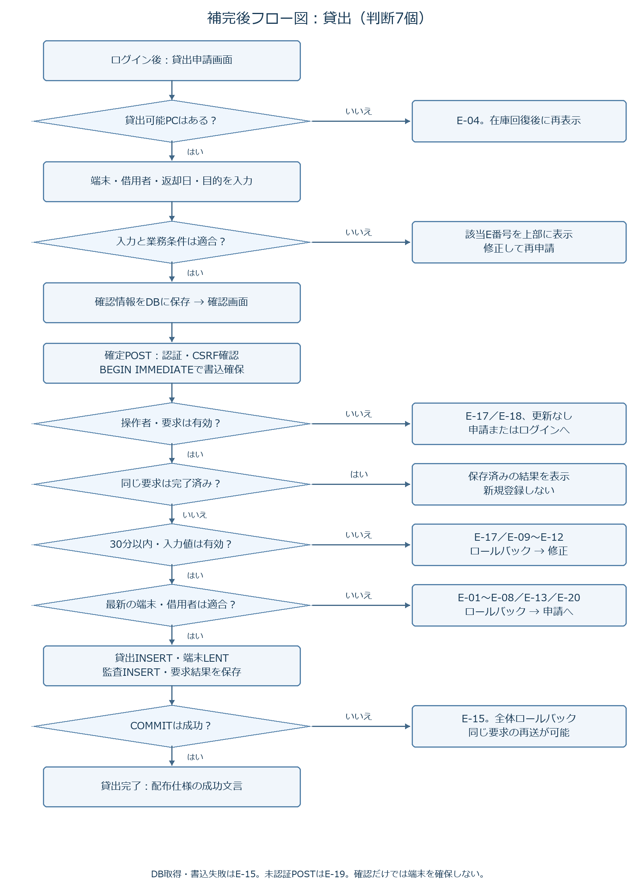
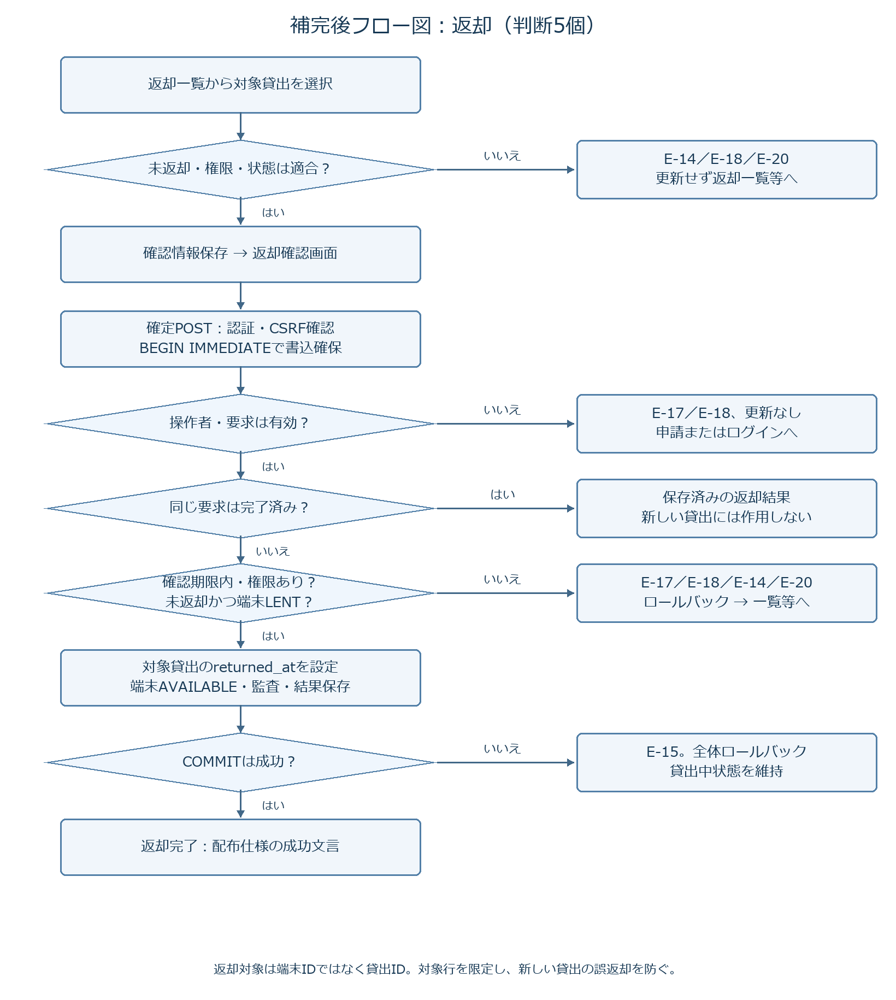

# 補完後のフロー図

配布資料の「入力→確認→DB更新→完了」と「返却→DB更新→完了」に分岐を追記した再作図です。実装版に合わせて描いています。

- 貸出：ひし形7個。
- 返却：ひし形5個。
- 合計12個。

例外の枝はその要求の処理を中止する出口です。修正後は入力から再実行します。図の「COMMIT失敗」以外も、トランザクション内で発生した例外はすべてロールバックします。確定後のHTTP応答断はDBを取り消さず、同じ要求の再送または元の結果URLで照会します。自動照会UIは未実装です。
